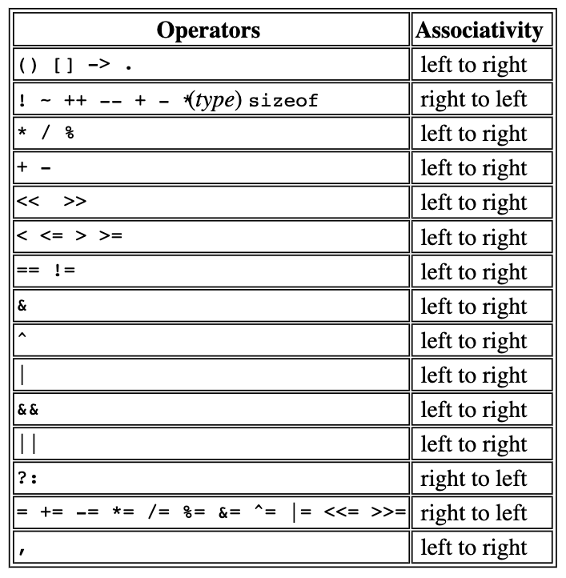

# The C programming language notes

## Function prototype

Function declaration is also called a function prototype. Example of a function
prototype:

```c
int power(int m, int n);
```

## Automatic variables

Local variables are also known as _automatic variables_ because they
automatically come to existence when the function is called and disappears when
the function is exited.

## Definition vs Declaration

_Definition_ refers to the place where the variable is created or assigned
storage; _declaration_ refers to places where the nature of the variable is
stated but no storage is allocated.

## Types

The type of an object determines the set of values it can have andwhat
operations can be performed on it

## Precendence and order of evaluation


